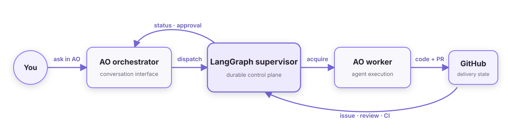

<div align="center">

<h1>Agent Workflow Supervisor</h1>

<h3>Durable issue-to-merge orchestration for Agent Orchestrator.</h3>

</div>

Agent Workflow Supervisor gives
[Agent Orchestrator](https://aoagents.dev/) long-running workflows for moving
an issue through implementation, review, approval, and merge. If an
orchestrator or worker session stops, the workflow state remains available and
can continue from its last durable checkpoint.

AO stays at the center of the experience. It remains the desktop interface,
session manager, worktree owner, and agent runner. This package uses
[LangGraph](https://github.com/langchain-ai/langgraph) to coordinate policy and
delivery state around those AO sessions.

Install version 0.2.0 from GitHub:

```bash
uv tool install git+https://github.com/weryk153/agent-workflow-supervisor.git@v0.2.0
```

Then follow the [installation guide](docs/installation.md) for one-time project
integration and a safe shadow-mode check. After setup, normal operation happens
inside AO rather than in a separate terminal.

## Why use Agent Workflow Supervisor?

- **Durable execution** — work queues and LangGraph checkpoints survive
  supervisor and agent-session restarts.
- **AO-first operation** — users dispatch work, check progress, approve changes,
  and select accounts from the AO orchestrator conversation.
- **Deterministic routing** — project policy chooses an eligible worker from
  configured labels, models, accounts, and capacity.
- **No duplicate workers** — canonical per-work-item locks and durable
  reservations serialize identity across config files, while a user-global
  allocation lock and reservation-backed recheck protect project harness
  limits plus shared model and login capacity across projects.
- **Review and CI awareness** — delivery advances only when the current change
  has the required review and checks; a bounded watchdog recovers failed or
  timed-out AO reviewers instead of waiting silently forever.
- **User-selected merge control** — each project chooses automatic merge or a
  manual, head-bound approval gate; protected labels always pause.
- **Guarded merge** — stale approval cannot merge a newer, unreviewed commit.

## How it fits with AO



The supervisor talks to AO through its public local CLI. It does not embed,
patch, fork, or replace the AO app. AO continues to show the real sessions,
worktrees, pull requests, and live agent state.

## Work from the AO conversation

Once a project is integrated, open its orchestrator in AO and ask naturally:

- **Start work** — “Handle issue #123.”
- **Check progress** — “What is the status of issue #123?”
- **Make a decision** — “Approve issue #123.” or “Reject issue #123.”
- **Choose merge behavior** — “Require approval before merge.” or “Enable
  automatic merge.”
- **Inspect accounts** — “List the configured Claude accounts.”
- **Change account** — “Switch this project to the work account.”
- **Inspect models** — “Which models are assigned to this project?”

The managed AO rules translate these explicit requests into supervisor actions
and summarize the result in the same conversation. Discussing or planning an
issue does not start it; the user must clearly authorize execution.

The terminal is reserved for initial installation, interactive login,
automation, and recovery. Day-to-day supervision does not require users to
remember CLI syntax.

See [Using the supervisor from AO](docs/ao-integration.md) for the full
conversation contract and the small set of operations that still need a
terminal.

## What happens after dispatch

1. The supervisor reads the issue and applies project routing policy.
2. It checks capacity and reuses or acquires an eligible AO worker.
3. The worker implements the change in its AO-managed workspace.
4. The supervisor reconciles the pull request, current-head review, and CI.
5. Manual-merge projects and protected work pause for human approval, then
   recheck every change gate.
6. An approved current head is merged with a commit-match guard; automatic
   projects skip only the human confirmation, not review or CI.
7. The completed worker is cleaned up while workflow history remains durable.

The supervisor never scans GitHub and starts work by itself. Every work item
begins with an explicit request from the user or an intentional automation.

## Configuration and integrations

The built-in workflow combines:

- **Agent Orchestrator** for orchestrator and worker sessions, worktrees,
  terminals, and agent execution.
- **GitHub** for issues, pull requests, reviews, checks, and merge state.
- **LangGraph with SQLite** for local checkpoints and approval interrupts.
- **Isolated Claude logins** with explicit per-project account assignment.
- **Hosted or local model profiles**, including OpenCode readiness checks for
  Ollama and LM Studio.

The package does not prescribe personal roles such as “Claude implements” or
“Codex makes art.” Harness roles, model choices, research policy, label meaning,
and capacity belong to operator configuration.

The graph depends on `RunnerPort` and `TrackerPort`. Other execution runtimes or
trackers can be supported with new adapters without placing their SDKs in the
workflow graph.

## Safety

- New project configurations start in shadow mode.
- External mutations require explicit apply authorization.
- Review and human approval are tied to the exact change and head SHA. Decisions
  are accepted only while that gate is currently paused, and approval without a
  target SHA is rejected.
- A queued decision is atomically consumed before graph resume. A crash may ask
  for approval again, but cannot replay it against a later gate.
- Draft, mergeability, merge-state, and CI gates are revalidated after a human
  approval resumes the workflow.
- New and unspecified project policies default to manual merge. Automatic merge
  must be selected explicitly per project.
- Merge requires GitHub to still report that same head commit.
- Account records reference profiles and config directories, not OAuth tokens
  or API keys.
- Service ownership is verified from an atomic record and live process command
  before stop signals are sent; one lifetime lock permits one daemon per
  project runtime directory.
- Numeric, qualified, and GitHub-URL forms of the same issue share one queue,
  checkpoint, worker lookup, and acquisition identity.
- Model profiles select existing runtimes; they do not download or redistribute
  providers or model weights.

Read [Architecture and safety boundaries](docs/architecture.md) and the
[Security policy](SECURITY.md) before extending adapters or deployment modes.

## Documentation

- [Installation](docs/installation.md) — one-time setup and first safe workflow
- [AO integration](docs/ao-integration.md) — conversation behavior and recovery
- [Configuration](docs/configuration.md) — project policy and precedence
- [Multiple Claude logins](docs/multiple-claude-logins.md) — isolated accounts
- [Model profiles](docs/model-profiles.md) — hosted and local models
- [Multi-project operation](docs/multi-project.md) — project-specific assignment
- [CLI reference](docs/cli-reference.md) — automation and recovery commands
- [Architecture](docs/architecture.md) — persistence and component boundaries
- [Troubleshooting](docs/troubleshooting.md) — failure diagnosis
- [Contributing](CONTRIBUTING.md) — development and open-source safety

## Project status

This is an early-stage, local, single-process supervisor. The included adapters
support AO and GitHub. SQLite is intended for one local supervisor; a
multi-process deployment needs a shared queue and PostgreSQL checkpointer.

## License

[Apache-2.0](LICENSE). AO is also Apache-2.0, but this project integrates
through AO's public local CLI and does not redistribute AO source. Models and
providers retain their own licenses.
